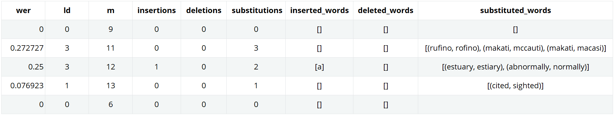

<h1 align="center">Word Error Rate for Python
<a href="https://twitter.com/intent/tweet?text=Introducing%20%23werpy%20-%20the%20Python%20package%20for%20fast%20and%20accurate%20Word%20Error%20Rate%20(WER)%20calculation.%20Analyze%20text%20accuracy%2C%20enhance%20%23NLP%20models%2C%20and%20improve%20%23SpeechRecognition%20systems.%20Try%20it%20now%3A%20&url=https://github.com/analyticsinmotion/werpy&via=analyticsmotion&hashtags=PythonPackage,WordErrorRate,WER,NLP">
    
  </a>
</h1>


<!-- badges: start -->

| | |
| --- | --- |
| Meta | [](https://www.python.org/downloads/)&nbsp;&nbsp; [](https://github.com/psf/black)&nbsp;&nbsp; [](https://werpy.readthedocs.io/en/latest/?badge=latest)&nbsp;&nbsp; [](https://www.analyticsinmotion.com) |
| License | [](https://github.com/analyticsinmotion/werpy/blob/main/LICENSE)&nbsp;&nbsp; [](https://app.fossa.com/projects/git%2Bgithub.com%2Fanalyticsinmotion/werpy?ref=badge_small)&nbsp;&nbsp; [](https://api.reuse.software/info/github.com/analyticsinmotion/werpy) |
| Security | [](https://github.com/analyticsinmotion/werpy/actions/workflows/codeql.yml)&nbsp;&nbsp; [](https://github.com/analyticsinmotion/werpy/actions/workflows/codacy.yml)&nbsp;&nbsp; [](https://github.com/analyticsinmotion/werpy/actions/workflows/bandit.yml) |
| Testing | [](https://www.codefactor.io/repository/github/analyticsinmotion/werpy)&nbsp;&nbsp; [](https://dl.circleci.com/status-badge/redirect/gh/analyticsinmotion/werpy/tree/main)&nbsp;&nbsp; [](https://codecov.io/gh/analyticsinmotion/werpy) |
| Package | [](https://pypi.org/project/werpy/)&nbsp;&nbsp; [](https://pypi.org/project/werpy/)&nbsp;&nbsp; [](https://pepy.tech/project/werpy)&nbsp;&nbsp; [](https://pypi.org/project/werpy/) |

<!-- badges: end -->


## What is werpy?
**werpy** is an ultra-fast, lightweight Python package for calculating and analyzing Word Error Rate (WER) between two sets of text.  
<br>
Built for flexibility and ease of use, it supports multiple input types such as strings, lists, and NumPy arrays. This makes it ideal for everything from quick experiments to large-scale evaluations.  
<br>
With speed in mind at every scale, werpy harnesses the efficiency of C optimizations to accelerate processing, delivering ultra-fast results from small datasets to enterprise-level workloads.


It also comes packed with powerful features, including:  
- 🔤 Built-in text normalization to handle data inconsistencies  
- ⚙️ Customizable error penalties for insertions, deletions, and substitutions  
- 📋 A detailed summary output for in-depth error analysis  

werpy is a quality-focused package, built to production-grade standards for reliability and robustness.
<br />


<!--
**werpy** is a powerful yet lightweight Python package that rapidly calculates and analyzes the Word Error Rate (WER) between two sets of text. 
It has been designed with the flexibility to handle multiple input data types such as strings, lists and NumPy arrays.<br />

The package also includes a full set of features such as normalizing the input text to account for data collection variability and the capability to easily assign different weights/penalties to specific error classifications (insertions, deletions, and substitutions).
Additionally, the summary function provides a comprehensive breakdown of the calculated results to assist in analyzing the specific errors quickly and in more detail.
<br />
-->

## Functions available in werpy
The following table provides an overview of the functions that can be used in werpy.

| Function  | Description | 
| ------------- | ------------- |
| normalize(text)  | Preprocess input text to remove punctuation, remove duplicated spaces, leading/trailing blanks and convert all words to lowercase. |
| wer(reference, hypothesis)  | Calculate the overall Word Error Rate for the entire reference and hypothesis texts. |
| wers(reference, hypothesis)  | Calculates a list of the Word Error Rates for each of the reference and hypothesis texts. |
| werp(reference, hypothesis)  | Calculates a weighted Word Error Rate for the entire reference and hypothesis texts. |
| werps(reference, hypothesis)  | Calculates a list of weighted Word Error Rates for each of the reference and hypothesis texts. |
| summary(reference, hypothesis)  | Provides a comprehensive breakdown of the calculated results including the WER, Levenshtein Distance and all the insertion, deletion and substitution errors. |
| summaryp(reference, hypothesis)  | Delivers an in-depth breakdown of the results, covering metrics like WER, Levenshtein Distance, and a detailed account of insertion, deletion, and substitution errors, inclusive of the weighted WER. |


## Installation
You can install the latest **werpy** release with Python's pip package manager:

```python
# Install werpy from PyPi
pip install werpy
```


## Usage
**Import the werpy package**

*Python Code:*
```python
import werpy
```
<br />

**Example 1 - Normalize a list of text**

*Python Code:*
```python
input_data = ["It's very popular in Antarctica.","The Sugar Bear character"]
reference = werpy.normalize(input_data)
print(reference)
```

*Results Output:*
```
['its very popular in antarctica', 'the sugar bear character']
```
<br />

**Example 2 - Calculate the overall Word Error Rate on a set of strings**

*Python Code:*
```python
wer = werpy.wer('i love cold pizza', 'i love pizza')
print(wer)
```

*Results Output:*
```
0.25
```
<br />

**Example 3 - Calculate the overall Word Error Rate on a set of lists**

*Python Code:*
```python
ref = ['i love cold pizza','the sugar bear character was popular']
hyp = ['i love pizza','the sugar bare character was popular']
wer = werpy.wer(ref, hyp)
print(wer)
```

*Results Output:*
```
0.2
```
<br />

**Example 4 - Calculate the Word Error Rates for each set of texts**

*Python Code:*
```python
ref = ['no one else could claim that','she cited multiple reasons why']
hyp = ['no one else could claim that','she sighted multiple reasons why']
wers = werpy.wers(ref, hyp)
print(wers)
```

*Results Output:*
```
[0.0, 0.2]
```
<br />

**Example 5 - Calculate the weighted Word Error Rates for the entire set of text**

*Python Code:*
```python
ref = ['it was beautiful and sunny today']
hyp = ['it was a beautiful and sunny day']
werp = werpy.werp(ref, hyp, insertions_weight=0.5, deletions_weight=0.5, substitutions_weight=1)
print(werp)
```

*Results Output:*
```
0.25
```
<br />

**Example 6 - Calculate a list of weighted Word Error Rates for each of the reference and hypothesis texts**

*Python Code:*
```python
ref = ['it blocked sight lines of central park', 'her father was an alderman in the city government']
hyp = ['it blocked sightlines of central park', 'our father was an elder man in the city government']
werps = werpy.werps(ref, hyp, insertions_weight = 0.5, deletions_weight = 0.5, substitutions_weight = 1)
print(werps)
```

*Results Output:*
```
[0.21428571428571427, 0.2777777777777778]
```
<br />

**Example 7 - Provide a complete breakdown of the Word Error Rate calculations for each of the reference and hypothesis texts**

*Python Code:*
```python
ref = ['it is consumed domestically and exported to other countries', 'rufino street in makati right inside the makati central business district', 'its estuary is considered to have abnormally low rates of dissolved oxygen', 'he later cited his first wife anita as the inspiration for the song', 'no one else could claim that']
hyp = ['it is consumed domestically and exported to other countries', 'rofino street in mccauti right inside the macasi central business district', 'its estiary is considered to have a normally low rates of dissolved oxygen', 'he later sighted his first wife anita as the inspiration for the song', 'no one else could claim that']
summary = werpy.summary(ref, hyp)
print(summary)
```

*Results Output:*
<!--  -->
<!--  -->
<!-- -->


<br />

**Example 8 - Provide a complete breakdown of the Weighted Word Error Rate for each of the input texts**

*Python Code:*
```python
ref = ['the tower caused minor discontent because it blocked sight lines of central park', 'her father was an alderman in the city government', 'he was commonly referred to as the blacksmith of ballinalee']
hyp = ['the tower caused minor discontent because it blocked sightlines of central park', 'our father was an alderman in the city government', 'he was commonly referred to as the blacksmith of balen alley']
weighted_summary = werpy.summaryp(ref, hyp, insertions_weight = 0.5, deletions_weight = 0.5, substitutions_weight = 1)
print(weighted_summary)
```

*Results Output:*


<br />

## Dependencies
- <a href="https://www.numpy.org">NumPy</a> - Provides an assortment of routines for fast operations on arrays
- <a href="https://pandas.pydata.org/">Pandas</a> - Powerful data structures for data analysis, time series, and statistics

## Licensing

``werpy`` is released under the terms of the BSD 3-Clause License. Please refer to the <a href="https://github.com/analyticsinmotion/werpy/blob/main/LICENSE">LICENSE</a> file for full details.

This project uses standard scientific Python libraries including NumPy and Pandas. For license details, please refer to their official repositories:

- NumPy - <a href="https://github.com/numpy/numpy">https://github.com/numpy/numpy</a>
- Pandas - <a href="https://github.com/pandas-dev/pandas">https://github.com/pandas-dev/pandas</a>
