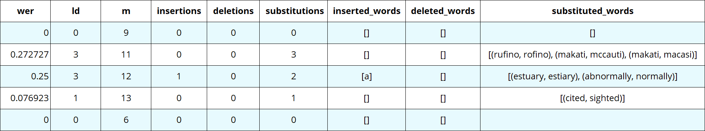
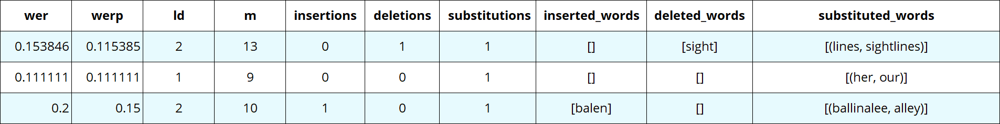

Summarization
=============

This module delivers detailed data summaries for each sequence, encompassing crucial metrics such as Word Error Rate (WER), Levenshtein Distance, and a comprehensive breakdown of insertions, deletions, and substitutions. 

The Summary Modules provides users with a granular understanding of system performance, facilitating quick and detailed error analysis. 
Its detailed insights empower users to swiftly identify and address errors, contributing to a more comprehensive evaluation of the system's strengths and areas for improvement.

Summary Analysis
----------------

*Python Code*

.. code-block:: python

   import werpy
   
   ref = ['it is consumed domestically and exported to other countries', 'rufino street in makati right inside the makati central business district', 'its estuary is considered to have abnormally low rates of dissolved oxygen', 'he later cited his first wife anita as the inspiration for the song', 'no one else could claim that']
   hyp = ['it is consumed domestically and exported to other countries', 'rofino street in mccauti right inside the macasi central business district', 'its estiary is considered to have a normally low rates of dissolved oxygen', 'he later sighted his first wife anita as the inspiration for the song', 'no one else could claim that']
   summary = werpy.summary(ref, hyp)
   print(summary)

*Results Output*

Weighted Summary Analysis
-------------------------

Apply the following weights/penalties to the errors:

- Insertions: 0.5
- Deletions: 0.5
- Substitutions: 1

*Python Code*

.. code-block:: python

   import werpy
   
   ref = ['the tower caused minor discontent because it blocked sight lines of central park', 'her father was an alderman in the city government', 'he was commonly referred to as the blacksmith of ballinalee']
   hyp = ['the tower caused minor discontent because it blocked sightlines of central park', 'our father was an alderman in the city government', 'he was commonly referred to as the blacksmith of balen alley']
   summaryp = werpy.summaryp(ref, hyp, insertions_weight = 0.5, deletions_weight = 0.5, substitutions_weight = 1)
   print(summaryp)

*Results Output*

Overall
-------

The capability of displaying a comprehensive breakdown of word error results within the summary modules offers a profound advantage in the evaluation and analysis of system performance. 
By presenting detailed metrics such as Word Error Rate (WER), Levenshtein Distance, and explicit counts of insertions, deletions, and substitutions, the summary module provides a nuanced understanding of errors on a per-sequence basis. 

This detailed breakdown not only enhances transparency in assessing the system's performance but also facilitates a granular examination of specific error types. 
The inclusion of weighted WER further refines this analysis, allowing for a context-aware evaluation that acknowledges the varying impact of different error categories. 

Such a detailed summary equips practitioners with valuable insights, enabling them to pinpoint areas of strength and weakness in the system, thereby informing targeted improvements and optimizations for enhanced overall performance.
